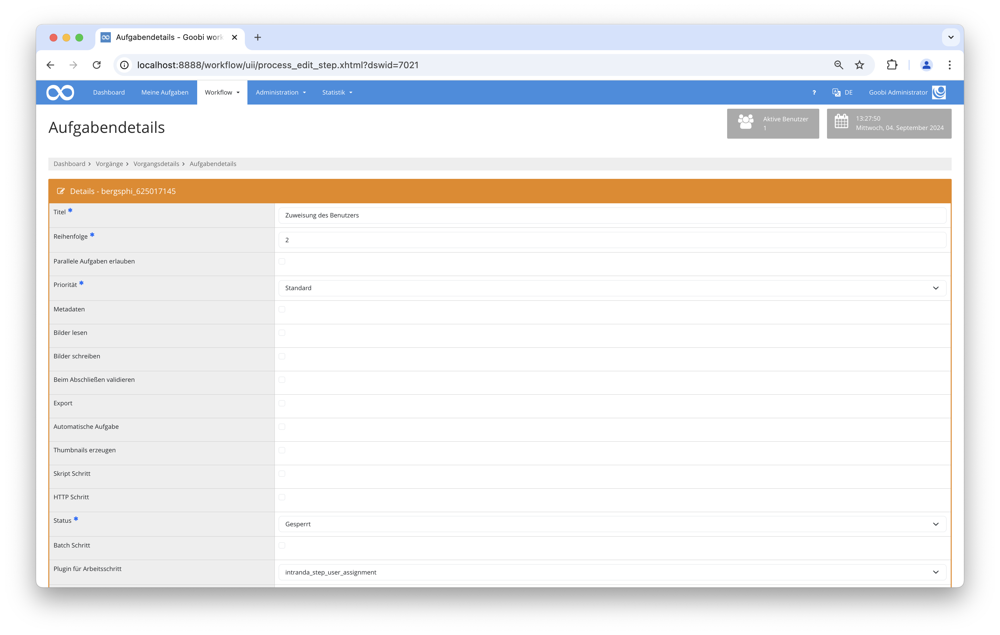
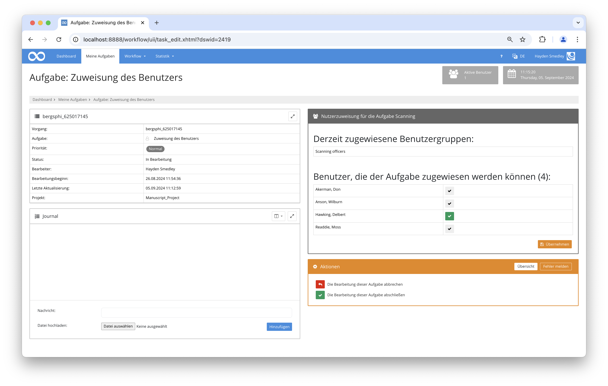

## Einführung
Diese Dokumentation erläutert das Plugin zur Zuweisung von Benutzern an bestimmte Aufgaben im Workflow.

## Installation
Um das Plugin nutzen zu können, müssen folgende Dateien installiert werden:

```bash
/opt/digiverso/goobi/plugins/step/plugin-step-user-assignment-base.jar
/opt/digiverso/goobi/config/plugin_intranda_step_user_assignment.xml
```

Für die Verwendung des Plugins muss dieses in einem Arbeitsschritt ausgewählt sein:



Nach der Ausführung des Plugins sieht die Oberfläche des Plugins folgendermaßen aus:



## Überblick und Funktionsweise
Zuerst müssen in der Konfigurationsdatei die jeweiligen individuellen Werte eingetragen werden. Anschließend kann das Plugin ausgeführt werden. Dabei sammelt es zunächst alle angegebenen Parameter und lädt anschließend alle Benutzer. Diesen können dann Aufgaben in der Benutzeroberfläche des Plugins zugewiesen werden.

## Konfiguration
Die Konfiguration des Plugins erfolgt in der Datei `plugin_intranda_step_user_assignment.xml` wie hier aufgezeigt:

{{CONFIG_CONTENT}}

{{CONFIG_DESCRIPTION_PROJECT_STEP}}

Parameter               | Erläuterung
------------------------|------------------------------------
`workflow`              | Der Name der Produktionsvorlage, die genutzt wird.|
`assignmentStep`        | Der Arbeitsschritt, in dem das Plugin aktiv wird, um Benutzer für den nächsten Schritt (`targetStep`) zuzuweisen. |
`targetStep`            | Der Arbeitsschritt, welcher der Benutzer zugewiesen wird.|
