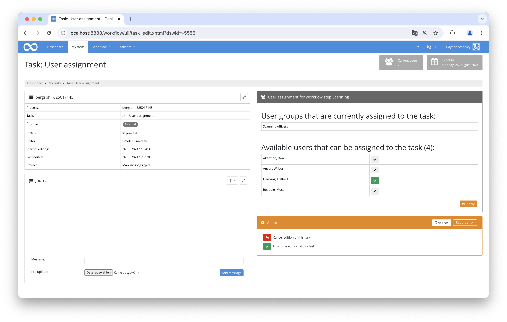

## Introduction
This documentation explains the plugin used for assigning users to specific tasks within the workflow.

## Installation
To be able to use the plugin, the following files must be installed:

```bash
/opt/digiverso/goobi/plugins/step/plugin-step-user-assignment-base.jar
/opt/digiverso/goobi/config/plugin_intranda_step_user_assignment.xml
```
To use the plugin, it must be selected in a workflow step:


After executing the plugin, the plugin interface will appear as follows:



## Overview and functionality
First, the respective individual values must be entered in the configuration file. Afterward, the plugin can be executed. It initially collects all specified parameters and then loads all users. These users can then be assigned tasks within the plugin's user interface.

## Configuration
The plugin is configured in the file `plugin_intranda_step_user_assignment.xml` as shown here:

{{CONFIG_CONTENT}}

{{CONFIG_DESCRIPTION_PROJECT_STEP}}

Parameter               | Explanation
------------------------|------------------------------------
`workflow`              | The name of the production template being used.|
`assignmentStep`        | The workflow step where the plugin activates to assign users for the next step (`targetStep`). |
`targetStep`            | The workflow step to which the user is assigned.|
